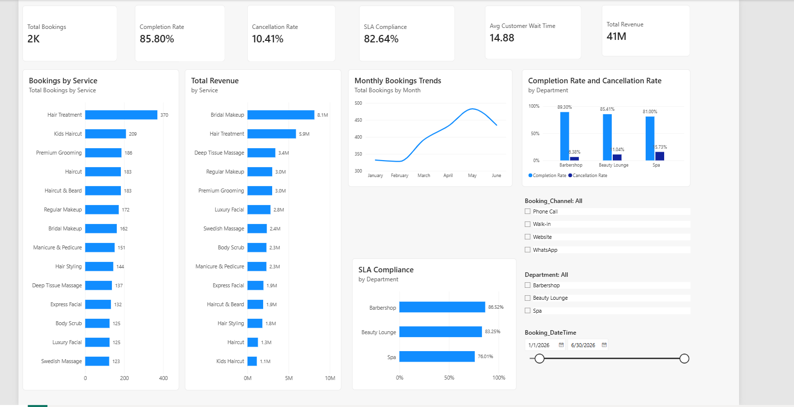

# IMAVUG-Service-Operations-Analytics
End-to-end service operations analytics project using Excel and Power BI to analyze bookings, service performance, SLA compliance, customer wait times, and revenue

## Project Overview
This project analyzes IMAVUG service operations data to better understand booking activity, service performance, customer experience, SLA compliance, and revenue.
The analysis follows an end-to-end data analytics workflow, beginning with data preparation and exploratory analysis in Excel and continuing with an interactive Power BI dashboard.
The goal is to transform operational data into meaningful insights that can support service performance and business decision-making

## Business Questions
The analysis was designed to answer the following questions:
- How many service bookings are being generated?
- Which services receive the highest number of bookings?
- Which services generate the most revenue?
- How do booking volumes change over time?
- How do completion and cancellation rates vary across departments?
- How well are departments meeting their SLA targets?
- How long are customers waiting for service?
- How do booking channel, department, and date affect operational performance?

## Tools & Skills Used

### Microsoft Excel
- Data cleaning and preparation
- Descriptive statistics
- PivotTables and PivotCharts
- Correlation and bivariate analysis
- Exploratory data analysis

### Power BI
- Data transformation with Power Query
- Data modeling
- DAX measures
- KPI development
- Interactive dashboard design
- Slicers and cross-filtering
- Operational and revenue analysis

## Power BI Dashboard

The interactive Power BI dashboard provides an overview of booking activity, revenue, operational performance, and SLA compliance across IMAVUG services and departments.

## Key Findings

- Hair Treatment recorded the highest booking volume, with 370 bookings.
- Bridal Makeup generated the highest revenue at approximately ₦8.1M, despite not having the highest booking volume.
- Monthly booking activity generally increased from January through May, with May recording the highest volume before declining in June.
- Barbershop recorded the highest completion rate at 89.30% and the lowest cancellation rate at 6.38%.
- Spa recorded the lowest completion rate at 81.00% and the highest cancellation rate at 15.73%.
- SLA performance varied across departments: Barbershop achieved 86.52%, Beauty Lounge 83.25%, and Spa 76.01%.
- The difference between high-volume services and high-revenue services shows that booking volume alone does not determine revenue contribution

## Business Recommendations

- Investigate the higher cancellation rate in the Spa department to identify scheduling, staffing, or service-related issues that may be affecting completed bookings.
- Review Spa SLA performance and operational processes, since its SLA compliance is lower than the other departments.
- Use high-demand services such as Hair Treatment to support staffing and scheduling decisions during periods of increased booking activity.
- Give additional attention to high-revenue services such as Bridal Makeup because they make a significant contribution to overall revenue even without the highest booking volume.
- Monitor monthly booking trends to anticipate periods of higher demand and adjust staffing and service capacity accordingly.
- Continue tracking completion rate, cancellation rate, customer wait time, and SLA compliance to identify operational changes over time

## Project Workflow

1. **Data Preparation** — Cleaned and prepared the service operations dataset for analysis.
2. **Excel Analysis** — Performed descriptive statistics, exploratory analysis, correlation analysis, and bivariate analysis.
3. **Power BI Analysis** — Built DAX measures and an interactive dashboard to analyze bookings, revenue, completion rates, cancellations, customer wait times, and SLA performance.
4. **SQL Analysis** — Coming next.
5. **Automation** — Planned.
6. **Machine Learning** — Planned as an advanced extension of the project
